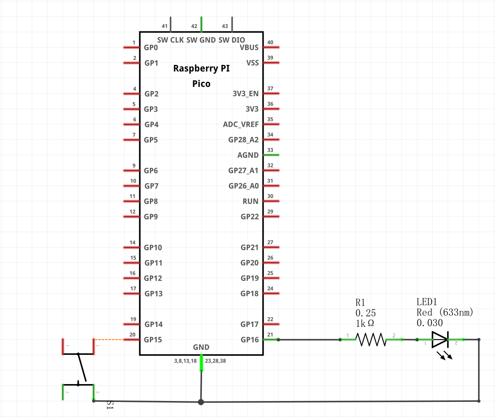
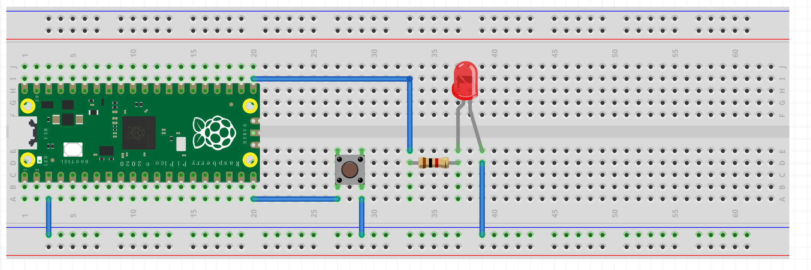

# GPIO
## 器件清单
器件 | 数量
---|---
焊接排针的Pico | 1
面包板  | 1
直插按键 | 1
直插LED | 1
适当阻值的直插电阻 | 1
杜邦线 | 若干
## 原理图

## 实物连接图

## 实现功能
当按键(GPIO25)按下时,外部LED电平翻转(GPIO16)并点亮板载LED(GPIO25).
当按键(GPIO25)释放后，熄灭板载LED(GPIO25).
## machine.Pin类
* machine.Pin(id, mode=-1, pull=-1, *, value)
    * id：GPIO编号，如使用GPIO13则此处填写13,数值为0-29。；
    * mode：模式,可选Pin.IN(0)、Pin.OUT(1)、Pin.OPEN_DRAIN(2)；
    * pull：使用内部上下拉电阻，可选 None(0)、Pin.PULL_UP(1)、Pin.PULL_DOWN(2)；
    * value：输出或开漏模式下端口值，0为低(off)、1为高(on)；
* Pin.init(mode=-1, pull=-1, *, value, drive, alt)
    * 重新初始化GPIO口；
    * mode：模式，可选Pin.IN(0)、Pin.OUT(1)、Pin.OPEN_DRAIN(2)；
    * pull：使用内部上下拉电阻，可选 None(0)、Pin.PULL_UP(1)、Pin.PULL_DOWN(2)；
    * value：输出或开漏模式下端口值，0为低(off)、1为高(on)；
* Pin.value([x])
    * 不填写参数使用时返回端口的值，参数0(False)、1(True)改变端口值；
* Pin.low()
    * 输出或开漏模式下将端口设置为低；
* Pin.high()
    * 输出或开漏模式下将端口设置为高；
* Pin.on()
    * 输出或开漏模式下将端口设置为高；
* Pin.off()
    * 输出或开漏模式下将端口设置为低；
* Pin.toggle()
    * 输出或开漏模式下将端口设置翻转；
* Pin.irq(handler=None, trigger=(Pin.IRQ_FALLING | Pin.IRQ_RISING), *, priority=1, wake=None, hard=False)
    * 用于设置外部中断
    * handler：中断触发回调函数；
    * trigger：中断触发源，设置为：
        * Pin.IRQ_FALLING 下降沿中断。
        * Pin.IRQ_RISING 在上升沿中断
    * priority: 优先级，越高优先级越高
    * wake：使能外部中断唤醒睡眠，可设置为：
        * machine.idle 
        * machine.lightsleep
        * machine.deepsleep
    * hard：如果为true，则为“ hard”，使用硬件中断。这减少了
       引脚更换和调用处理程序之间的延迟。硬件中断处理程序可能不会分配内存。并非所有端口都支持此参数。
       Pico_MircoPython_Examples