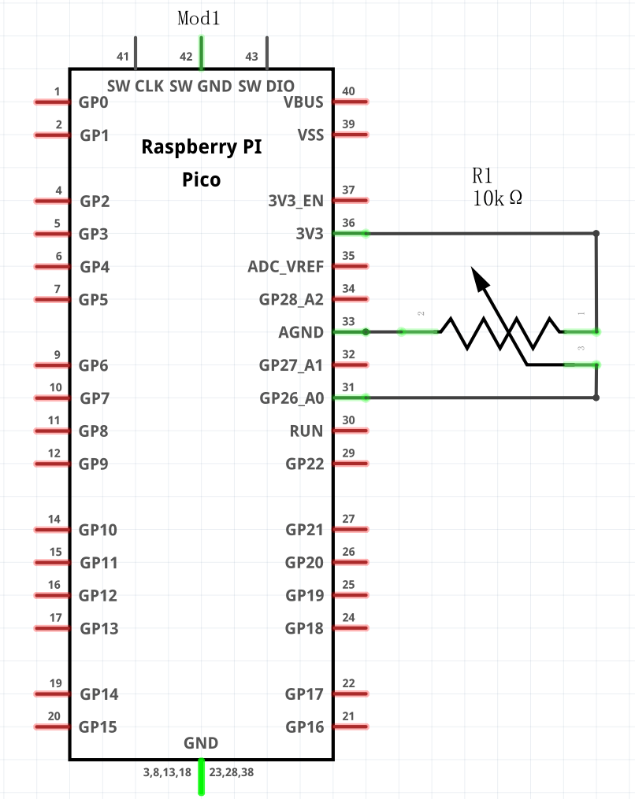
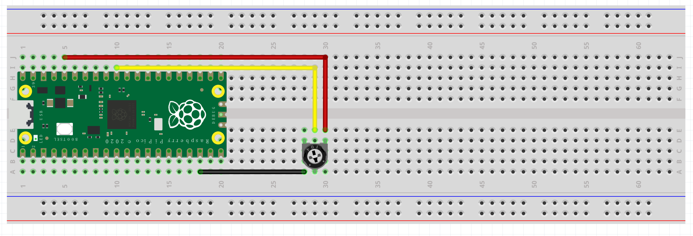

# ADC
## 器件清单
器件 | 数量
---|---
焊接排针的Pico | 1
面包板  | 1
蓝白电位器 | 1
双公头杜邦线 | 若干
## 原理图

## 实物连接图

## 实现功能
每秒读取一次读取GPIO26上的电压，并使用片内温度传感器采集温度。
## machine.ADC类
* machine.ADC(id):
    * ADC对象构造函数，并初始化对应通道。
    * id：可为GPIO对象，也可为ADC通道；
* ADC.read_u16():
    * 读取对应通道ADC数值