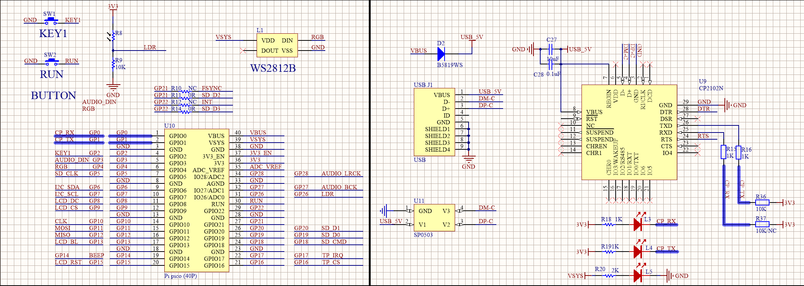

# UART
## 器件清单
器件 | 数量
---|---
焊接排针的Pico | 1
Pico-Eval-Board  | 1
USB TO Micro USB数据线 | 2
## 原理图

## 实现功能
根据UART接收到数据，开启或者关闭LED
## machine.UART类
* machine.UART(id,baudrate=115200,bits=8,parity=None,stop=1,tx=None,rx=None):
    * UART对象构造函数，作用为初始化对应通道和引脚.
    * id：使用UART通道，可为0或者1；
    * baudrate: 波特率参数
    * bits：数据位长度
    * parity：奇偶校验位
    * stop：停止位长度
    * tx：TXD引脚，应为Pin对象
    * rx：RXD引脚，应为Pin对象

machine.UART为UART对象构造函数，作用为初始化对应通道和引脚.

第一个参数id为使用UART通道，可为0或者1

第二个参数baudrate为使用波特率

第三个参数bits为数据位长度（现阶段仅8位有效）

第四个参数parity为是否使用奇偶校验位

第五个参数stop为停止位长度

第六和第七个参数tx和rx 为收发引脚，应为Pin对象

* UART.any():
    * any函数，用于检测当前接收缓冲区是否有数据，接收缓冲区有数据就返回1，否则返回0.

* UART.read([nbytes]):
    * read函数，用于读取字符串。
    * nbytes：如果指定了'nbytes，则最多读取这么多字节，否则读取尽可能多的数据。

* UART.readline()
    *  readline函数，读取一行，以换行符为结束标志。

* UART.readinto(buf[, nbytes])
    * readinto：将读取字符串存入指定缓存中
    * buf：用于指定缓存
    * nbytes：如果指定了'nbytes，则最多读取这么多字节，否则读取尽可能多的数据。

readinto函数，将读取字符串存入指定缓存中
buf用于指定缓存
nbytes和上文中read函数nbytes作用一致

* UART.write(buf)
    * write函数，用于发送字符串，返回值发送的字节数。
    * buf： 发送字符串
write函数用于发送字符串，并返回发送的字节数。
参数buf为需要发送的字符串

* UART.sendbreak()
    * sendbreak函数在总线上发送停止信号。
    这会将总线驱动为低电平的时间比字符正常传输所需要的时间更长。