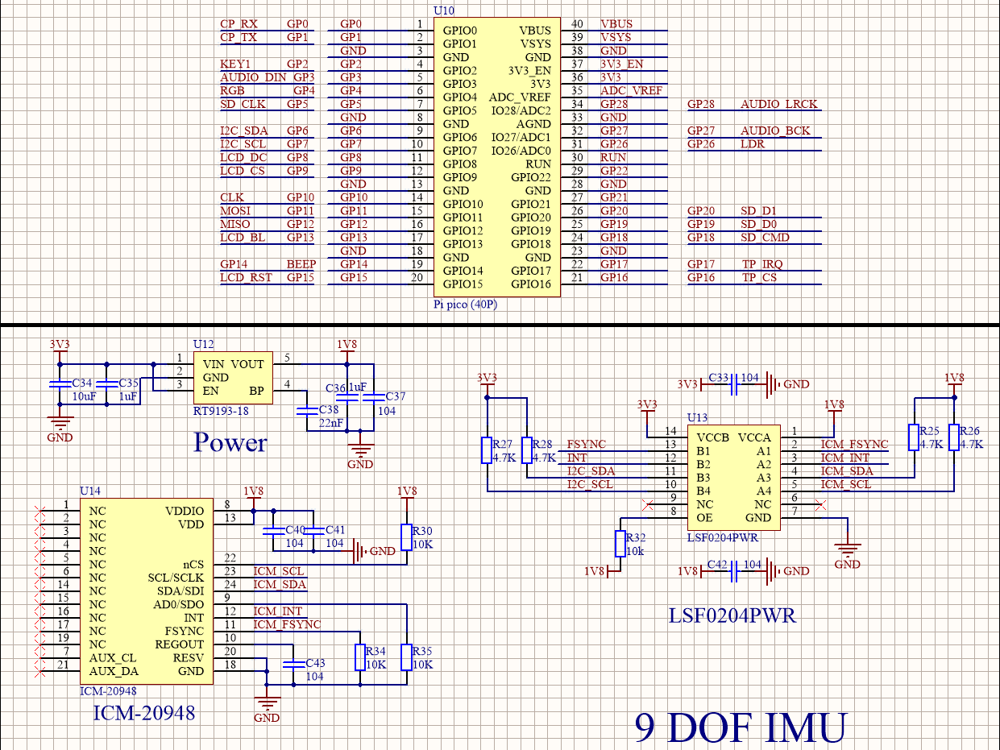

# I2C
## 器件清单
器件 | 数量
---|---
焊接排针的Pico | 1
Pico-Eval-Board  | 1
USB TO Micro USB数据线 | 1
## 原理图

## machine.I2C类
* machine.I2C(i2c_id,scl,sda,freq=400000)
    * I2C对象构造函数，作用为初始化对应通道和引脚.
    * i2c_id:使用I2C通道，可为0或者1；
    * scl：SCL引脚，应为Pin对象(I2C0默认为9，I2C1默认为7)
    * sda：SDA引脚，应为Pin对象(I2C0默认为8，I2C1默认为6)
    * freq：I2C时钟频率，默认为400Kb/S
* I2C.scan()
    * 扫描从设备函数，返回所有I2C总线上挂载从设备7位地址的列表。

* I2C.readfrom(addr, nbytes, stop=True)
    * readfrom函数其作用为通过I2C总线从设备读取数据并返回字节串。
    * addr：从设备地址。
    * nbytes：读取字符长度。
    * stop：是否在接收完成数据后发送结束信号。
* I2C.readfrom_into(addr, buf, stop=True)
    * readfrom_into函数其作用为readfro函数的升级版，可以将读取数据指定存放在字符数组中。
    * addr：从设备地址
    * buf：字符数组，用于存放数据
    * stop：是否在接收完成数据后发送结束信号
* I2C.writeto(addr, buf, stop=True)
    * writeto函数其作用为向从设备写入数据。
    * addr：从设备地址
    * buf：发送字符串
    * stop：是否在接收完成数据后发送结束信号
## 内存操作
* I2C.readfrom_mem(addr, memaddr, nbytes, *, addrsize=8)
    * readfrom_mem函数其作用为从设备的寄存器中读取数据。
    * addr：从设备地址
    * memaddr：寄存器地址
    * nbytes：读取字节长度
    * addrsize：寄存器地址长度
* I2C.readfrom_mem_into(addr, memaddr, buf, *, addrsize=8)
    * readfrom_mem_into函数其作用为从设备的寄存器中读取数据到指定字符数组。
    * addr：从设备地址
    * memaddr：寄存器地址
    * buf：字符数组，用于存放数据
    * addrsize：寄存器地址长度
* I2C.writeto_mem(addr, memaddr, buf, *, addrsize=8)
    * writeto_mem函数其作用为将数据写入从设备的寄存器
    * addr：从设备地址
    * memaddr：寄存器地址
    * buf：发送字符串
    * addrsize：寄存器地址长度

## 软件I2C
PS:以下函数，未经测试，仅通过官方文档描述编写
* I2C.start()
    * start函数其作用为在I2C总线中发送开始信号（SCL保持高电平，SDA转为低电平）
* I2C.stop() 
    * start函数其作用为在I2C总线中发送终止信号（SCL保持高电平，SDA转为低电平）
* I2C.readinto(buf, nack=True,)
    * readinto函数其作用为从I2C总线读取数据到指定的字符数组，读取长度为字符数组的长度。
    * buf：存放数据的字符数组 
    * nack：在接受最后一个数据后，是否发送nack信号
* I2C.write(buf)
    *  write函数其作用为将buf字符数组的数据写入到I2C总线中。
    *  buf：需要发送的字符数组

