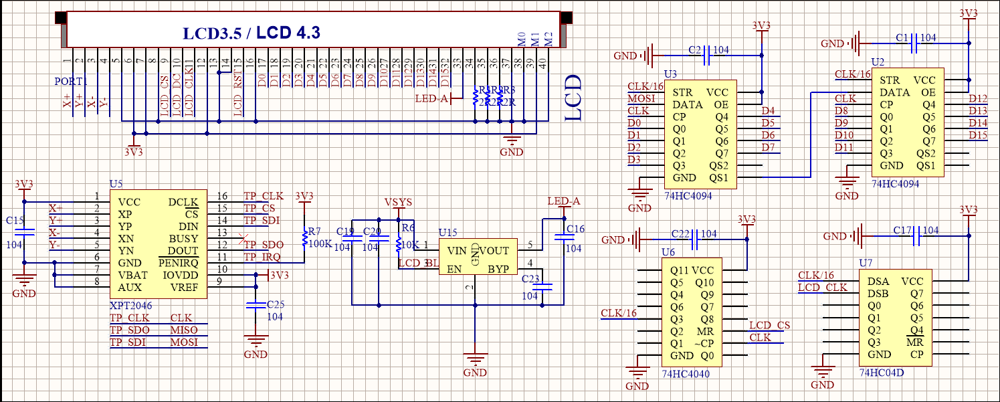

# SPI
## 器件清单
器件 | 数量
---|---
焊接排针的Pico | 1
Pico-Eval-Board  | 1
USB TO Micro USB数据线 | 1
## 原理图

## machine.I2C类
* machine.SPI(id,baudrate=1000000, polarity=0, phase=0, bits=8, firstbit=SPI.MSB, sck=None, mosi=None, miso=None)
    * SPI对象构造函数，作用为初始化对应通道和引脚
    * id：使用SPI通道，可为0或者1
    * baudrate: SPI通讯速率，也就是SCK引脚上的频率
    * polarity：时钟极性，若为0则总线空闲时SCK输出低电平，反之则输出高电平。
    * phase：时钟相位，若为0则在第一个时钟边缘捕获数据，反之则在第二个时钟边缘捕获数据。
    * bits：每次传输的数据位数
    * firstbit:先传输高位还是低位
    * sck：SCK引脚，应为Pin对象
    * mosi：MOSI引脚，应为Pin对象
    * miso：MISO引脚，应为Pin对象
    * sck、mosi和miso均为SPI使用的引脚，应为Pin对象
* SPI.init()
    * init函数，用于重新开启SPI
* SPI.deinit()
    * deinit函数，用于关闭SPI
* SPI.read(nbytes,write=0x00)
    * read函数,用于读取从设备数据并返回
    * nbytes：读取字节数
    * write：读取数据时，MOSI输出数据。
* SPI.readinto(buf,write=0x00)
    * readinto函数，用于读取从设备数据并存入指定字符数组中。
    * buf：字符数组，用于存放接收数据
    * write：读取数据时，MOSI输出数据。
* SPI.write(buf)
    * write函数，将字符数组写入从设备。
    * buf：字符数组，用于存放传输数据
* SPI.write_readinto(write_buf, read_buf)
    * write_readinto函数，用于同时发送和接收数据
    * write_buf：字符数组，用于存放传输数据
    * read_buf：字符数组，用于存放接收数据
    * PS: 这里传输和接收数据的字符数组的长度要求一致。