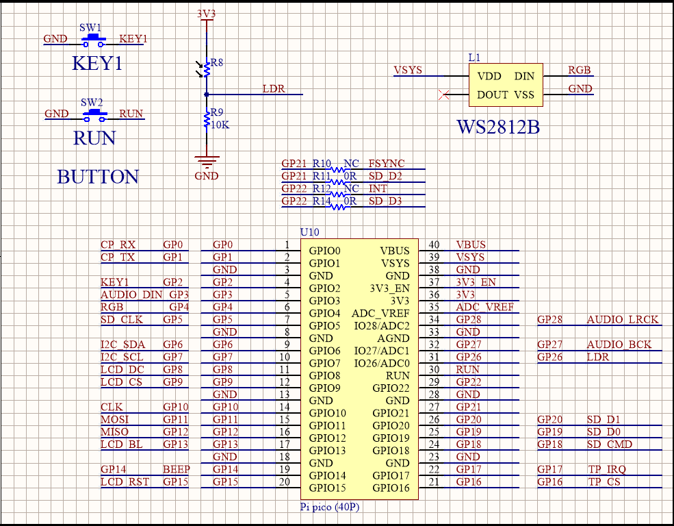
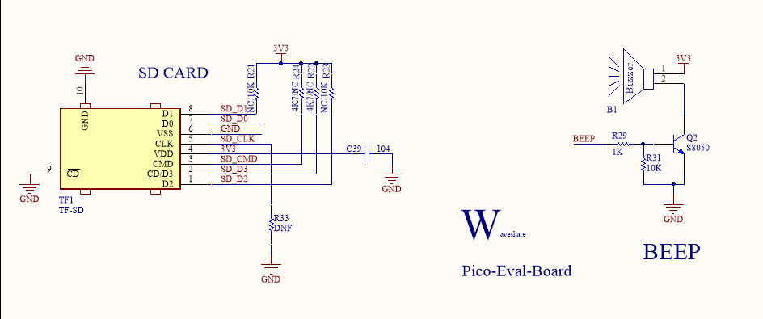

# PIO
## 器件清单
器件 | 数量
---|---
焊接排针的Pico | 1
Pico-Eval-Board  | 1
USB TO Micro USB数据线 | 1

## 原理图
### WS2812B RBG LED

### I2S

### SDIO

## 函数详解
### @asm_pio装饰器
    @asm_pio(
        out_init=None,
        set_init=None,
        sideset_init=None,
        in_shiftdir=0,
        out_shiftdir=0,
        autopush=False,
        autopull=False,
        push_thresh=32,
        pull_thresh=32,
        fifo_join=0
    )
* out_init :输出引脚初始化
* set_init :设置引脚初始化
* sideset_init :侧置引脚初始化
* in_shiftdir : 数据输入方向
* out_shiftdir:数据输出方向
* autopush :自动推送，若开启，当ISR达到阈值，自动将ISR传输到RX-FIFO。
* autopull :自动拉取，若开启，当OSR达到阈值，自动将TX-FIFO传输到OSR。
* push_thresh :推送阈值
* pull_thresh :拉取阈值
* fifo_join ：fifo组合，指定一个FIFO，将另一个FIFO关闭并加入改FIFO，获取更深位数的FIFO.
### StateMachine状态机
* rp2.StateMachine(sm_id ,program, freq=-1, *, in_base=None, out_base=None, set_base=None, jmp_pin=None, sideset_base=None, in_shiftdir=None, out_shiftdir=None, push_thresh=None, pull_thresh=None)
    * sm_id:使用状态机ID
    * program:PIO运行程序
    * freq：状态机运行频率，默认为系统时钟频率，
      * 因为时钟分频器的分频因子计算公式为“系统时钟频率/频率”，所以可能存在轻微的舍入误差。
    * in_base：用于in()指令的第一个引脚
    * out_base：用于out()指令的第一个引脚
    * set_base：用于set()指令的第一个引脚
    * jmp_pin：用于jmp(pin, ...)指令的第一个引脚
    * sideset_base：是用于侧置的第一个引脚。
    * in_shiftdir：ISR将移动的方向，可为PIO.SHIFT_LEFT或者PIO.SHIFT_RIGHT
    * out_shiftdir： OSR 将移动的方向，可为PIO.SHIFT_LEFT或者PIO.SHIFT_RIGHT
    * push_thresh：推送阈值
    * pull_thresh：拉取阈值
* StateMachine.active([value])
    * 获取或设置状态机当前是否正在运行。
    * 当value不为空时，设置状态机，反之获取运行状态。
* StateMachine.restart()
    * 重新启动状态机并跳转到程序的开头。
* StateMachine.exec(instr)
    * 执行单个 PIO 指令。
    * instr：指令字符串。
* StateMachine.get(buf=None, shift=0)
    * 从状态机的RX-FIFO中提取一个字，如果FIFO为空，它会阻塞直到数据到达（即状态机推一个字）。
    * 该值在返回之前右移 *shift* 位，即返回值是“word >> shift”
* StateMachine.put(value, shift=0)
    * 将一个字推送到状态机的 TX FIFO。
    * 如果 FIFO已满，它将阻塞直到有空间（即状态机拉一个字）。
    * 该值在返回之前右移 *shift* 位，即返回值是“word >> shift”
* StateMachine.rx_fifo()
    * 返回状态机的 RX FIFO 中的字数。值为0表示 FIFO 为空。
    * 用于在调用之前检查数据是否正在等待读取`StateMachine.get()`。
* StateMachine.tx_fifo()
    * 返回状态机的 RX FIFO 中的字数。值为0表示 FIFO 为空。
    * 用于在调用之前检查数据是否正在等待读取`StateMachine.put()`。
* StateMachine.irq(handler=None, trigger=0|1, hard=False)
    * 返回给定 StateMachine 的 IRQ 对象。